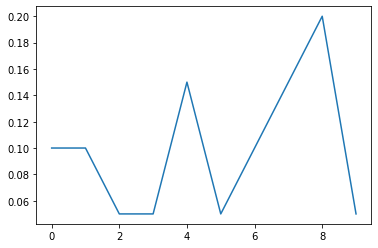

```python
## Python basics for novice data scientists, supported by Wagatsuma Lab@Kyutech 
#
# The MIT License (MIT): Copyright (c) 2020 Hiroaki Wagatsuma and Wagatsuma Lab@Kyutech
# 
# Permission is hereby granted, free of charge, to any person obtaining a copy of this software and associated documentation files (the "Software"), to deal in the Software without restriction, including without limitation the rights to use, copy, modify, merge, publish, distribute, sublicense, and/or sell copies of the Software, and to permit persons to whom the Software is furnished to do so, subject to the following conditions:
# The above copyright notice and this permission notice shall be included in all copies or substantial portions of the Software.
# THE SOFTWARE IS PROVIDED "AS IS", WITHOUT WARRANTY OF ANY KIND, EXPRESS OR IMPLIED, INCLUDING BUT NOT LIMITED TO THE WARRANTIES OF MERCHANTABILITY, FITNESS FOR A PARTICULAR PURPOSE AND NONINFRINGEMENT. IN NO EVENT SHALL THE AUTHORS OR COPYRIGHT HOLDERS BE LIABLE FOR ANY CLAIM, DAMAGES OR OTHER LIABILITY, WHETHER IN AN ACTION OF CONTRACT, TORT OR OTHERWISE, ARISING FROM, OUT OF OR IN CONNECTION WITH THE SOFTWARE OR THE USE OR OTHER DEALINGS IN THE SOFTWARE. */
#
# # @Time    : 2022-8-10 
# # @Author  : Hiroaki Wagatsuma
# # @Site    : https://github.com/hirowgit/2A1_python_intermediate_course
# # @IDE     : Python 3.9.13 (main, Aug  7 2022, 01:33:23)  [Clang 13.1.6 (clang-1316.0.21.2.5)] on darwin
# # @File    : lec2_step1.py 
```


```python
import numpy as np
import matplotlib.pyplot as plt
```


```python
allData = np.loadtxt('allData200.csv', delimiter=',', dtype='int64')
allData
```


    array([[ 9,  7,  3, ...,  4,  1, 10],
           [ 6,  4, 10, ...,  5,  1,  2],
           [ 4,  3,  6, ..., 10,  1,  8],
           ...,
           [ 3,  4,  1, ...,  2,  7,  8],
           [ 6,  7,  3, ...,  8,  9,  4],
           [ 9,  8,  5, ..., 10,  7,  6]])


```python
a = np.array([[1,2,4],[3,2,1]])
np.sort(a, axis=None)
```


    array([1, 1, 2, 2, 3, 4])


```python
np.sort(a, axis=0) 
```


    array([[1, 2, 1],
           [3, 2, 4]])


```python
allData_sample=allData[0:20,:]
np.sort(allData_sample,axis=0) 
```


    array([[ 1,  1,  2,  1,  1,  1,  1,  1,  1,  1],
           [ 2,  2,  2,  1,  1,  1,  1,  2,  1,  2],
           [ 2,  3,  3,  2,  1,  2,  1,  2,  1,  2],
           [ 2,  3,  3,  2,  1,  3,  1,  2,  1,  5],
           [ 3,  3,  3,  3,  2,  3,  2,  2,  2,  6],
           [ 3,  4,  3,  4,  3,  4,  2,  3,  2,  6],
           [ 4,  4,  4,  5,  3,  4,  3,  3,  3,  7],
           [ 4,  4,  4,  5,  5,  4,  3,  3,  4,  7],
           [ 5,  4,  4,  5,  5,  4,  4,  4,  5,  7],
           [ 6,  4,  5,  6,  6,  4,  5,  4,  5,  7],
           [ 6,  5,  5,  7,  6,  5,  5,  5,  5,  7],
           [ 7,  6,  6,  7,  6,  6,  5,  5,  6,  7],
           [ 8,  6,  6,  8,  7,  6,  6,  5,  7,  7],
           [ 8,  6,  6,  8,  7,  7,  7,  6,  7,  8],
           [ 8,  7,  7,  8,  9,  8,  8,  6,  8,  9],
           [ 9,  7,  7,  9,  9,  8,  8,  8,  9,  9],
           [ 9,  8,  8,  9, 10,  9,  8,  8,  9,  9],
           [ 9,  8,  9,  9, 10, 10,  8,  8, 10, 10],
           [ 9, 10,  9,  9, 10, 10,  9, 10, 10, 10],
           [10, 10, 10, 10, 10, 10,  9, 10, 10, 10]])


```python
data = np.array([[3, 0, 0, .24],
                 [4, 1, 1, .41],
                 [2, 1, 1, .63],
                 [1, 1, 3, .38]]) #imagine rows of a spreadsheet
#now do sortrows(data,[3,-4])
ix = np.lexsort((data[:, 3][::-1], data[:, 2])) 
#this yields [0, 2, 1, 3]

#note that lexsort sorts first from the last row, so sort keys are in reverse order

data[ix]
```


    array([[3.  , 0.  , 0.  , 0.24],
           [2.  , 1.  , 1.  , 0.63],
           [4.  , 1.  , 1.  , 0.41],
           [1.  , 1.  , 3.  , 0.38]])


```python
sample_2d = np.array([[50,4, 89], [5, 150, 20], [110, 8, 1]])
print(sample_2d)
print(' ')

col_id = 1
print(sample_2d[:, col_id])
print(' ')
print(np.argsort(a_2d[:, col_id]))
```

    [[ 50   4  89]
     [  5 150  20]
     [110   8   1]]
     
    [  4 150   8]
     
    [0 2 1]


```python
sorted_by_col = sample_2d[np.argsort(sample_2d[:, col_id])]
print(sorted_by_col)
```

    [[ 50   4  89]
     [110   8   1]
     [  5 150  20]]


```python
allData_sample
```


    array([[ 9,  7,  3,  5,  6,  2,  8,  4,  1, 10],
           [ 6,  4, 10,  7,  9,  3,  8,  5,  1,  2],
           [ 4,  3,  6,  2,  7,  5,  9, 10,  1,  8],
           [ 3,  6,  7,  4,  1,  8,  2,  5,  9, 10],
           [ 1, 10,  4,  8,  7,  6,  3,  5,  2,  9],
           [ 7,  8,  9,  2,  3,  4,  5, 10,  1,  6],
           [ 9,  4,  2,  5, 10,  3,  1,  8,  6,  7],
           [ 5,  8,  4,  9,  3,  1,  7,  6,  2, 10],
           [ 9, 10,  3,  6,  1,  4,  8,  2,  5,  7],
           [ 3,  6,  2, 10,  1,  9,  4,  8,  5,  7],
           [ 2,  4,  3,  9,  6, 10,  1,  8,  5,  7],
           [ 8,  5,  4,  9,  2,  1,  6,  3, 10,  7],
           [ 8,  4,  7,  9,  5, 10,  2,  1,  3,  6],
           [ 4,  3,  8,  1, 10,  6,  5,  2,  7,  9],
           [10,  2,  5,  1,  6,  4,  8,  3,  9,  7],
           [ 6,  4,  9,  8,  1, 10,  5,  3,  7,  2],
           [ 9,  6,  3,  5, 10,  4,  1,  2,  8,  7],
           [ 2,  1,  5,  8, 10,  7,  3,  6,  4,  9],
           [ 2,  7,  6,  3,  5,  8,  9,  4, 10,  1],
           [ 8,  3,  6,  7,  9,  4,  1,  2, 10,  5]])


```python
sorted_data=np.sort(allData_sample, axis=0) 
sorted_data
```


    array([[ 1,  1,  2,  1,  1,  1,  1,  1,  1,  1],
           [ 2,  2,  2,  1,  1,  1,  1,  2,  1,  2],
           [ 2,  3,  3,  2,  1,  2,  1,  2,  1,  2],
           [ 2,  3,  3,  2,  1,  3,  1,  2,  1,  5],
           [ 3,  3,  3,  3,  2,  3,  2,  2,  2,  6],
           [ 3,  4,  3,  4,  3,  4,  2,  3,  2,  6],
           [ 4,  4,  4,  5,  3,  4,  3,  3,  3,  7],
           [ 4,  4,  4,  5,  5,  4,  3,  3,  4,  7],
           [ 5,  4,  4,  5,  5,  4,  4,  4,  5,  7],
           [ 6,  4,  5,  6,  6,  4,  5,  4,  5,  7],
           [ 6,  5,  5,  7,  6,  5,  5,  5,  5,  7],
           [ 7,  6,  6,  7,  6,  6,  5,  5,  6,  7],
           [ 8,  6,  6,  8,  7,  6,  6,  5,  7,  7],
           [ 8,  6,  6,  8,  7,  7,  7,  6,  7,  8],
           [ 8,  7,  7,  8,  9,  8,  8,  6,  8,  9],
           [ 9,  7,  7,  9,  9,  8,  8,  8,  9,  9],
           [ 9,  8,  8,  9, 10,  9,  8,  8,  9,  9],
           [ 9,  8,  9,  9, 10, 10,  8,  8, 10, 10],
           [ 9, 10,  9,  9, 10, 10,  9, 10, 10, 10],
           [10, 10, 10, 10, 10, 10,  9, 10, 10, 10]])


```python
diffData=np.diff(sorted_data,axis=0)
diffData
```


    array([[1, 1, 0, 0, 0, 0, 0, 1, 0, 1],
           [0, 1, 1, 1, 0, 1, 0, 0, 0, 0],
           [0, 0, 0, 0, 0, 1, 0, 0, 0, 3],
           [1, 0, 0, 1, 1, 0, 1, 0, 1, 1],
           [0, 1, 0, 1, 1, 1, 0, 1, 0, 0],
           [1, 0, 1, 1, 0, 0, 1, 0, 1, 1],
           [0, 0, 0, 0, 2, 0, 0, 0, 1, 0],
           [1, 0, 0, 0, 0, 0, 1, 1, 1, 0],
           [1, 0, 1, 1, 1, 0, 1, 0, 0, 0],
           [0, 1, 0, 1, 0, 1, 0, 1, 0, 0],
           [1, 1, 1, 0, 0, 1, 0, 0, 1, 0],
           [1, 0, 0, 1, 1, 0, 1, 0, 1, 0],
           [0, 0, 0, 0, 0, 1, 1, 1, 0, 1],
           [0, 1, 1, 0, 2, 1, 1, 0, 1, 1],
           [1, 0, 0, 1, 0, 0, 0, 2, 1, 0],
           [0, 1, 1, 0, 1, 1, 0, 0, 0, 0],
           [0, 0, 1, 0, 0, 1, 0, 0, 1, 1],
           [0, 2, 0, 0, 0, 0, 1, 2, 0, 0],
           [1, 0, 1, 1, 0, 0, 0, 0, 0, 0]])


```python

```


    array([[1, 0, 0, 1, 0, 1, 0, 1, 1, 0, 1, 1, 0, 0, 1, 0, 0, 0, 1],
           [1, 1, 0, 0, 1, 0, 0, 0, 0, 1, 1, 0, 0, 1, 0, 1, 0, 2, 0],
           [0, 1, 0, 0, 0, 1, 0, 0, 1, 0, 1, 0, 0, 1, 0, 1, 1, 0, 1],
           [0, 1, 0, 1, 1, 1, 0, 0, 1, 1, 0, 1, 0, 0, 1, 0, 0, 0, 1],
           [0, 0, 0, 1, 1, 0, 2, 0, 1, 0, 0, 1, 0, 2, 0, 1, 0, 0, 0],
           [0, 1, 1, 0, 1, 0, 0, 0, 0, 1, 1, 0, 1, 1, 0, 1, 1, 0, 0],
           [0, 0, 0, 1, 0, 1, 0, 1, 1, 0, 0, 1, 1, 1, 0, 0, 0, 1, 0],
           [1, 0, 0, 0, 1, 0, 0, 1, 0, 1, 0, 0, 1, 0, 2, 0, 0, 2, 0],
           [0, 0, 0, 1, 0, 1, 1, 1, 0, 0, 1, 1, 0, 1, 1, 0, 1, 0, 0],
           [1, 0, 3, 1, 0, 1, 0, 0, 0, 0, 0, 0, 1, 1, 0, 0, 1, 0, 0]])


```python
key=np.where(np.transpose(diffData)>0)
key
```


    (array([0, 0, 0, 0, 0, 0, 0, 0, 0, 1, 1, 1, 1, 1, 1, 1, 1, 2, 2, 2, 2, 2,
            2, 2, 2, 3, 3, 3, 3, 3, 3, 3, 3, 3, 4, 4, 4, 4, 4, 4, 4, 5, 5, 5,
            5, 5, 5, 5, 5, 5, 6, 6, 6, 6, 6, 6, 6, 6, 7, 7, 7, 7, 7, 7, 7, 8,
            8, 8, 8, 8, 8, 8, 8, 8, 9, 9, 9, 9, 9, 9, 9]),
     array([ 0,  3,  5,  7,  8, 10, 11, 14, 18,  0,  1,  4,  9, 10, 13, 15, 17,
             1,  5,  8, 10, 13, 15, 16, 18,  1,  3,  4,  5,  8,  9, 11, 14, 18,
             3,  4,  6,  8, 11, 13, 15,  1,  2,  4,  9, 10, 12, 13, 15, 16,  3,
             5,  7,  8, 11, 12, 13, 17,  0,  4,  7,  9, 12, 14, 17,  3,  5,  6,
             7, 10, 11, 13, 14, 16,  0,  2,  3,  5, 12, 13, 16]))


```python
kj=key[0]
kj
```


    array([0, 0, 0, 0, 0, 0, 0, 0, 0, 1, 1, 1, 1, 1, 1, 1, 1, 2, 2, 2, 2, 2,
           2, 2, 2, 3, 3, 3, 3, 3, 3, 3, 3, 3, 4, 4, 4, 4, 4, 4, 4, 5, 5, 5,
           5, 5, 5, 5, 5, 5, 6, 6, 6, 6, 6, 6, 6, 6, 7, 7, 7, 7, 7, 7, 7, 8,
           8, 8, 8, 8, 8, 8, 8, 8, 9, 9, 9, 9, 9, 9, 9])


```python
ki=key[1]
ki
```


    array([ 0,  3,  5,  7,  8, 10, 11, 14, 18,  0,  1,  4,  9, 10, 13, 15, 17,
            1,  5,  8, 10, 13, 15, 16, 18,  1,  3,  4,  5,  8,  9, 11, 14, 18,
            3,  4,  6,  8, 11, 13, 15,  1,  2,  4,  9, 10, 12, 13, 15, 16,  3,
            5,  7,  8, 11, 12, 13, 17,  0,  4,  7,  9, 12, 14, 17,  3,  5,  6,
            7, 10, 11, 13, 14, 16,  0,  2,  3,  5, 12, 13, 16])


```python
bodyK=np.where(np.diff(kj)>0)
bodyK
```


    (array([ 8, 16, 24, 33, 40, 49, 57, 64, 73]),)


```python
sizeD=np.shape(allData_sample)
sizeD
```


    (20, 10)


```python
# n0=np.array([0],dtype=int)
np.concatenate([bodyK, bodyK],axis=1)
```


    array([[ 8, 16, 24, 33, 40, 49, 57, 64, 73,  8, 16, 24, 33, 40, 49, 57,
            64, 73]])


```python
np.array([0])
```


    array([0])


```python
bodyK
```


    (array([ 5, 11, 16, 21, 28, 38, 43, 50]),)


```python
bodyK
```


    (array([ 5, 11, 16, 21, 28, 38, 43, 50]),)


```python
a1 = np.ones((1,3), int)
a2 = np.ones((1,3), int)
np.concatenate([a1, a2],axis=1)
```


    array([[1, 1, 1, 1, 1, 1]])


```python
a1 = np.ones((1,3), int)
```


```python
[0,list(bodyK), len(kj)]
```


    [0, [array([ 5, 11, 16, 21, 28, 38, 43, 50])], 57]


```python
np.shape(bodyK)
```


    (1, 8)


```python
len(kj)
```


    57


```python
 len(kj)*np.ones((1,1), int)
```


    array([[57]])


```python
[[ len(kj)]]
```


    [[57]]


```python
bodyK
```


    (array([ 5, 11, 16, 21, 28, 38, 43, 50]),)


```python
list(bodyK)
```


    [array([ 5, 11, 16, 21, 28, 38, 43, 50])]


```python
arr_1d=list(bodyK)
bodyK.tolist()
```


    ---------------------------------------------------------------------------

    AttributeError                            Traceback (most recent call last)

    /var/folders/mg/w5t8lkhc8xj79f001s7kzpfh0000gp/T/ipykernel_46672/3209845136.py in <module>
          1 arr_1d=list(bodyK)
    ----> 2 bodyK.tolist()
    

    AttributeError: 'tuple' object has no attribute 'tolist'


```python
bodyK
```


    (array([ 5, 11, 16, 21, 28, 38, 43, 50]),)


```python
bodyK
```


    (array([ 5, 11, 16, 21, 28, 38, 43, 50]),)


```python
kj
```


    array([0, 0, 0, 0, 0, 0, 1, 1, 1, 1, 1, 1, 2, 2, 2, 2, 2, 3, 3, 3, 3, 3,
           4, 4, 4, 4, 4, 4, 4, 5, 5, 5, 5, 5, 5, 5, 5, 5, 5, 6, 6, 6, 6, 6,
           7, 7, 7, 7, 7, 7, 7, 8, 8, 8, 8, 8, 8])


```python
kj[bodyK]
```


    array([0, 1, 2, 3, 4, 5, 6, 7])


```python
ab=np.concatenate([[[0]], bodyK],axis=1)
```


    array([[ 0,  5, 11, 16, 21, 28, 38, 43, 50]])


```python
kj[ab]
```


    ---------------------------------------------------------------------------

    NameError                                 Traceback (most recent call last)

    /var/folders/mg/w5t8lkhc8xj79f001s7kzpfh0000gp/T/ipykernel_46672/942133995.py in <module>
    ----> 1 kj[ab]
    

    NameError: name 'ab' is not defined


```python
bodyK2=bodyK+np.array([[1]])
sect_id=np.insert(bodyK2, 0,0)
sect_id=np.append(sect_id, len(kj))
sect_id
```


    array([ 0,  9, 17, 25, 34, 41, 50, 58, 65, 74, 81])


```python
kj
```


    array([0, 0, 0, 0, 0, 0, 0, 0, 0, 1, 1, 1, 1, 1, 1, 1, 1, 2, 2, 2, 2, 2,
           2, 2, 2, 3, 3, 3, 3, 3, 3, 3, 3, 3, 4, 4, 4, 4, 4, 4, 4, 5, 5, 5,
           5, 5, 5, 5, 5, 5, 6, 6, 6, 6, 6, 6, 6, 6, 7, 7, 7, 7, 7, 7, 7, 8,
           8, 8, 8, 8, 8, 8, 8, 8, 9, 9, 9, 9, 9, 9, 9])


```python
ki
```


    array([ 0,  3,  5,  7,  8, 10, 11, 14, 18,  0,  1,  4,  9, 10, 13, 15, 17,
            1,  5,  8, 10, 13, 15, 16, 18,  1,  3,  4,  5,  8,  9, 11, 14, 18,
            3,  4,  6,  8, 11, 13, 15,  1,  2,  4,  9, 10, 12, 13, 15, 16,  3,
            5,  7,  8, 11, 12, 13, 17,  0,  4,  7,  9, 12, 14, 17,  3,  5,  6,
            7, 10, 11, 13, 14, 16,  0,  2,  3,  5, 12, 13, 16])


```python
kj[sect_id]
```


    array([0, 1, 2, 3, 4, 5, 6, 7, 8, 8])


```python
kj[sect_id[0]:sect_id[1]]
```


    array([0, 0, 0, 0, 0, 0, 1])


```python
sect_id[1]
```


    6


```python
g2=np.arange(sect_id[0],sect_id[1])
g2
```


    array([0, 1, 2, 3, 4, 5, 6, 7, 8])


```python
kj[sect_id[1]:sect_id[2]]
```


    array([1, 1, 1, 1, 1, 1])


```python
kj[g2]
```


    array([0, 0, 0, 0, 0, 0])


```python
sect_id
```


    array([ 0,  6, 12, 17, 22, 29, 39, 44, 51, 56])


```python
setN=sizeD[0]
NofD=sizeD[1]
```


```python
sect_eg=np.vstack([sect_id[0:-1],sect_id[1:]])
sect_eg
```


    array([[ 0,  9, 17, 25, 34, 41, 50, 58, 65, 74],
           [ 9, 17, 25, 34, 41, 50, 58, 65, 74, 81]])


```python
sect_egT=np.transpose(sect_eg)
sect_egT
```


    array([[ 0,  9],
           [ 9, 17],
           [17, 25],
           [25, 34],
           [34, 41],
           [41, 50],
           [50, 58],
           [58, 65],
           [65, 74],
           [74, 81]])


```python
[sect_egT[i]  for i in range(0,5)]

```


    [array([0, 9]),
     array([ 9, 17]),
     array([17, 25]),
     array([25, 34]),
     array([34, 41])]


```python
sect_egT[0][1]
```


    4


```python
len(sect_egT)
```


    19


```python
[kj[sect_egT[i][0]:sect_egT[i][1]]  for i in range(0,len(sect_egT))]
```


    [array([0, 0, 0, 0, 0, 0, 0, 0, 0]),
     array([1, 1, 1, 1, 1, 1, 1, 1]),
     array([2, 2, 2, 2, 2, 2, 2, 2]),
     array([3, 3, 3, 3, 3, 3, 3, 3, 3]),
     array([4, 4, 4, 4, 4, 4, 4]),
     array([5, 5, 5, 5, 5, 5, 5, 5, 5]),
     array([6, 6, 6, 6, 6, 6, 6, 6]),
     array([7, 7, 7, 7, 7, 7, 7]),
     array([8, 8, 8, 8, 8, 8, 8, 8, 8]),
     array([9, 9, 9, 9, 9, 9, 9])]


```python
sect_range=[ki[sect_egT[i][0]:sect_egT[i][1]]  for i in range(0,len(sect_egT))]
sect_range
```


    [array([ 0,  3,  5,  7,  8, 10, 11, 14, 18]),
     array([ 0,  1,  4,  9, 10, 13, 15, 17]),
     array([ 1,  5,  8, 10, 13, 15, 16, 18]),
     array([ 1,  3,  4,  5,  8,  9, 11, 14, 18]),
     array([ 3,  4,  6,  8, 11, 13, 15]),
     array([ 1,  2,  4,  9, 10, 12, 13, 15, 16]),
     array([ 3,  5,  7,  8, 11, 12, 13, 17]),
     array([ 0,  4,  7,  9, 12, 14, 17]),
     array([ 3,  5,  6,  7, 10, 11, 13, 14, 16]),
     array([ 0,  2,  3,  5, 12, 13, 16])]


```python
[np.diff(np.hstack([-1,d,setN-1])) for d in sect_range]
```


    [array([1, 3, 2, 2, 1, 2, 1, 3, 4, 1]),
     array([1, 1, 3, 5, 1, 3, 2, 2, 2]),
     array([2, 4, 3, 2, 3, 2, 1, 2, 1]),
     array([2, 2, 1, 1, 3, 1, 2, 3, 4, 1]),
     array([4, 1, 2, 2, 3, 2, 2, 4]),
     array([2, 1, 2, 5, 1, 2, 1, 2, 1, 3]),
     array([4, 2, 2, 1, 3, 1, 1, 4, 2]),
     array([1, 4, 3, 2, 3, 2, 3, 2]),
     array([4, 2, 1, 1, 3, 1, 2, 1, 2, 3]),
     array([1, 2, 1, 2, 7, 1, 3, 3])]


```python
[np.diff(np.hstack([-1,d,setN-1]))/setN for d in sect_range]
```


    [array([0.05, 0.15, 0.1 , 0.1 , 0.05, 0.1 , 0.05, 0.15, 0.2 , 0.05]),
     array([0.05, 0.05, 0.15, 0.25, 0.05, 0.15, 0.1 , 0.1 , 0.1 ]),
     array([0.1 , 0.2 , 0.15, 0.1 , 0.15, 0.1 , 0.05, 0.1 , 0.05]),
     array([0.1 , 0.1 , 0.05, 0.05, 0.15, 0.05, 0.1 , 0.15, 0.2 , 0.05]),
     array([0.2 , 0.05, 0.1 , 0.1 , 0.15, 0.1 , 0.1 , 0.2 ]),
     array([0.1 , 0.05, 0.1 , 0.25, 0.05, 0.1 , 0.05, 0.1 , 0.05, 0.15]),
     array([0.2 , 0.1 , 0.1 , 0.05, 0.15, 0.05, 0.05, 0.2 , 0.1 ]),
     array([0.05, 0.2 , 0.15, 0.1 , 0.15, 0.1 , 0.15, 0.1 ]),
     array([0.2 , 0.1 , 0.05, 0.05, 0.15, 0.05, 0.1 , 0.05, 0.1 , 0.15]),
     array([0.05, 0.1 , 0.05, 0.1 , 0.35, 0.05, 0.15, 0.15])]


```python
NofE_data=[np.diff(np.hstack([-1,ki[sect_egT[i][0]:sect_egT[i][1]],setN-1]))   for i in range(0,len(sect_egT))]
NofE_data
```


    [array([1, 3, 2, 2, 1, 2, 1, 3, 4, 1]),
     array([1, 1, 3, 5, 1, 3, 2, 2, 2]),
     array([2, 4, 3, 2, 3, 2, 1, 2, 1]),
     array([2, 2, 1, 1, 3, 1, 2, 3, 4, 1]),
     array([4, 1, 2, 2, 3, 2, 2, 4]),
     array([2, 1, 2, 5, 1, 2, 1, 2, 1, 3]),
     array([4, 2, 2, 1, 3, 1, 1, 4, 2]),
     array([1, 4, 3, 2, 3, 2, 3, 2]),
     array([4, 2, 1, 1, 3, 1, 2, 1, 2, 3]),
     array([1, 2, 1, 2, 7, 1, 3, 3])]


```python
NofE_data_p=[np.diff(np.hstack([-1,ki[sect_egT[i][0]:sect_egT[i][1]],setN-1]))/setN   for i in range(0,len(sect_egT))]
NofE_data_p
```


    [array([0.05, 0.15, 0.1 , 0.1 , 0.05, 0.1 , 0.05, 0.15, 0.2 , 0.05]),
     array([0.05, 0.05, 0.15, 0.25, 0.05, 0.15, 0.1 , 0.1 , 0.1 ]),
     array([0.1 , 0.2 , 0.15, 0.1 , 0.15, 0.1 , 0.05, 0.1 , 0.05]),
     array([0.1 , 0.1 , 0.05, 0.05, 0.15, 0.05, 0.1 , 0.15, 0.2 , 0.05]),
     array([0.2 , 0.05, 0.1 , 0.1 , 0.15, 0.1 , 0.1 , 0.2 ]),
     array([0.1 , 0.05, 0.1 , 0.25, 0.05, 0.1 , 0.05, 0.1 , 0.05, 0.15]),
     array([0.2 , 0.1 , 0.1 , 0.05, 0.15, 0.05, 0.05, 0.2 , 0.1 ]),
     array([0.05, 0.2 , 0.15, 0.1 , 0.15, 0.1 , 0.15, 0.1 ]),
     array([0.2 , 0.1 , 0.05, 0.05, 0.15, 0.05, 0.1 , 0.05, 0.1 , 0.15]),
     array([0.05, 0.1 , 0.05, 0.1 , 0.35, 0.05, 0.15, 0.15])]


```python
NofE_data_p[1]
```


    array([0.05, 0.05, 0.15, 0.25, 0.05, 0.15, 0.1 , 0.1 , 0.1 ])


```python
x=np.arange(0,NofD)
y=NofE_data_p[3]
plt.plot(x,y)
plt.show()
```


    

    


```python

```


```python
np.arange(0,NofD)
```


    array([0, 1, 2, 3, 4, 5, 6, 7, 8, 9])


```python
sorted_data
```


    array([[ 1,  1,  2,  1,  1,  1,  1,  1,  1,  1],
           [ 2,  2,  2,  1,  1,  1,  1,  2,  1,  2],
           [ 2,  3,  3,  2,  1,  2,  1,  2,  1,  2],
           [ 2,  3,  3,  2,  1,  3,  1,  2,  1,  5],
           [ 3,  3,  3,  3,  2,  3,  2,  2,  2,  6],
           [ 3,  4,  3,  4,  3,  4,  2,  3,  2,  6],
           [ 4,  4,  4,  5,  3,  4,  3,  3,  3,  7],
           [ 4,  4,  4,  5,  5,  4,  3,  3,  4,  7],
           [ 5,  4,  4,  5,  5,  4,  4,  4,  5,  7],
           [ 6,  4,  5,  6,  6,  4,  5,  4,  5,  7],
           [ 6,  5,  5,  7,  6,  5,  5,  5,  5,  7],
           [ 7,  6,  6,  7,  6,  6,  5,  5,  6,  7],
           [ 8,  6,  6,  8,  7,  6,  6,  5,  7,  7],
           [ 8,  6,  6,  8,  7,  7,  7,  6,  7,  8],
           [ 8,  7,  7,  8,  9,  8,  8,  6,  8,  9],
           [ 9,  7,  7,  9,  9,  8,  8,  8,  9,  9],
           [ 9,  8,  8,  9, 10,  9,  8,  8,  9,  9],
           [ 9,  8,  9,  9, 10, 10,  8,  8, 10, 10],
           [ 9, 10,  9,  9, 10, 10,  9, 10, 10, 10],
           [10, 10, 10, 10, 10, 10,  9, 10, 10, 10]])


```python
sect_range=[ki[sect_egT[i][0]:sect_egT[i][1]]  for i in range(0,len(sect_egT))]
sect_range
```


```python
g3[0]
```


    array([0, 6])


```python
sect_id[0:-1]
```


    array([ 0,  5, 11, 16, 21, 28, 38, 43, 50])


```python
kj[sect_id[0:-1]]
```


    array([0, 0, 1, 2, 3, 4, 5, 6, 7])


```python
bodyK
```


    (array([ 5, 11, 16, 21, 28, 38, 43, 50]),)


```python
bodyK-np.array([[1]])
```


    array([[ 4, 10, 15, 20, 27, 37, 42, 49]])


```python
setN
```


    ---------------------------------------------------------------------------

    NameError                                 Traceback (most recent call last)

    /var/folders/mg/w5t8lkhc8xj79f001s7kzpfh0000gp/T/ipykernel_46672/466309160.py in <module>
    ----> 1 setN
    

    NameError: name 'setN' is not defined


```python

```
